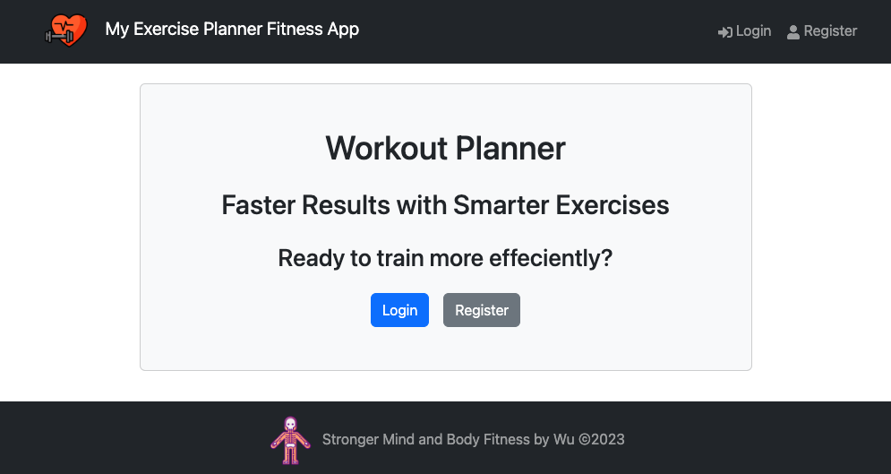
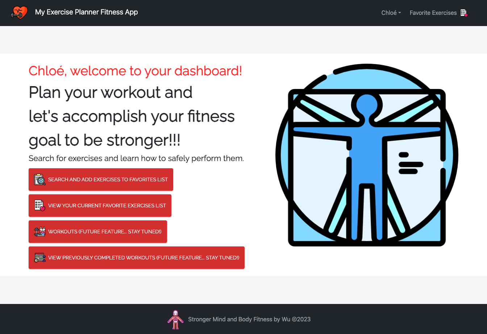
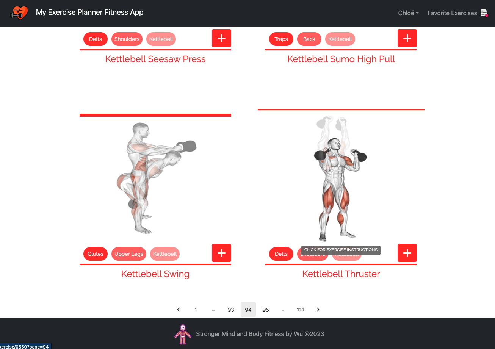
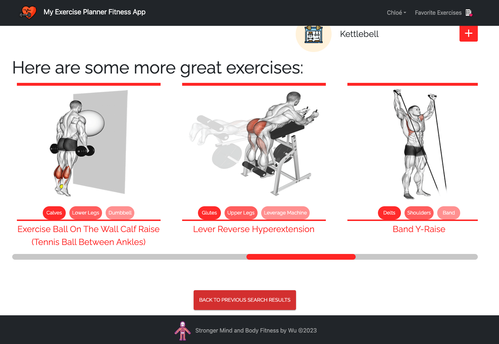
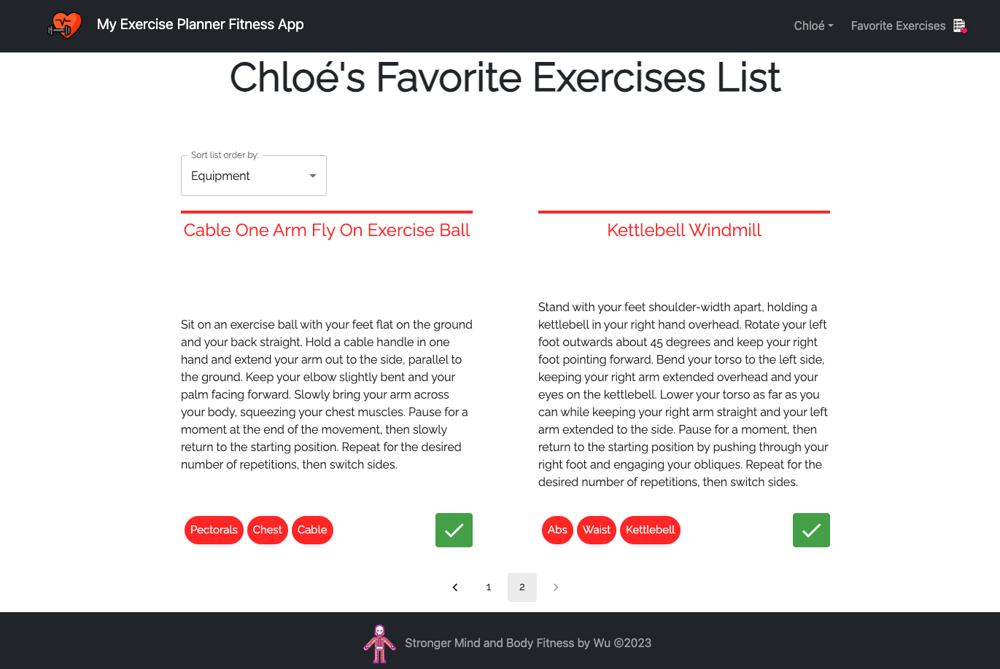

# Exercise Fitness App

## Overview

The Exercise Fitness App is a full-stack MERN web application with CRUD functionality designed to help users discover, manage, and track their favorite exercises. In my previous careers as a firefighter and personal trainer, fitness is a huge part of my lifestyle. As a new software programmer, I want to share the joys of learning new exercises. This application provides a user-friendly interface for exploring a vast collection of exercises, saving personal favorites, and receiving personalized recommendations. The application follows a client-server architecture, utilizing React on the client side and Express with MongoDB on the server side.

## Table of Contents

- [Features](#features)
- [Tech Stack](#tech-stack)
- [Getting Started](#getting-started)
- [Usage](#usage)
- [Deployment](#deployment)
- [License](#license)
- [Acknowledgments](#acknowledgments)

## Features

- **Explore Exercises:** Browse a comprehensive list of exercises with details such as muscle targets, equipment requirements, and instructions.

- **Save Favorites:** Users can create an account, log in, and save their favorite exercises for quick access.

- **Sorting and Filtering:** Organize exercises based on various criteria such as name, body part, target muscle, and more.

- **Responsive Design:** The user interface is designed to be responsive, ensuring a seamless experience across different devices and screen sizes.

## Tech Stack

### Client Side

- React
- Redux Toolkit for state management
- Material-UI for UI components
- Axios for HTTP requests
- React Router for navigation
- Bootstrap for styling
- React-Toastify
- Rapid API

### Server Side

- Express.js
- MongoDB with Mongoose for data storage
- JWT for user authentication
- Bcrypt for password hashing
- NodeJS

## Getting Started

Running the Project Locally:

1. **Clone the Repository:**

   ```bash
   git clone https://github.com/Peter-JC-Wu/exercise-fitness-app.git
   cd exercise-fitness-app
   ```

2. **Install Dependencies:**

   ```bash
   npm install
   ```

3. **Set Up Environment Variables:**

   - Create a `.env` file in the root of the `exercise-fitness-app` folder.
   - Add the necessary environment variables, such as MongoDB connection string and JWT secret.

4. **Run the Application:**

   ```bash
   npm run dev
   ```

   This will start both the server and client applications concurrently.

5. **Access the App:**
   Open your browser and navigate to [http://localhost:3000](http://localhost:3000) to access the Exercise Fitness App.

## Usage

Explore the user-friendly interface:

- **Login/Register Page:**
  

- **Welcome Dashboard:**
  

- **Exercise Search Results:**
  

- **More Exercise Options at the Details Page:**
  

- **Favorites List:**
  

## Deployment

Will update this section with link when deployed online.

## License

This project is licensed under the [ISC License](LICENSE).

## Acknowledgments

- Special thanks to friends, mentor [(Osama Tahir)](https://github.com/osamaahmed17), and [Parsity Online Code School](https://parsity.io/).
- Inspired by Rapid API [(ExerciseDB)](https://rapidapi.com/justin-WFnsXH_t6/api/exercisedb).